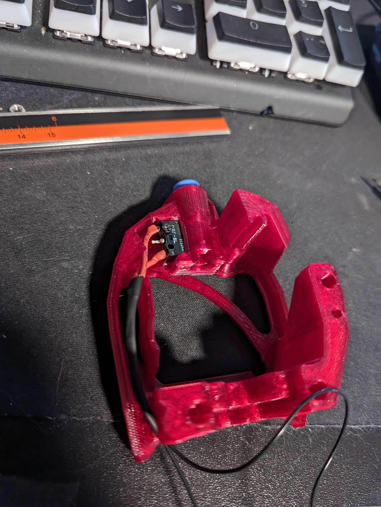

# BT-LGXLite-THS-SB
LGX Lite TH Sensor for Stealth Burner

BOM
|QTY|Pos|
|---|---|	
|1x |4mm Steel Ball|
|1x |omron Microswitch (D2F-FL / D2F-5L)|
|2x |Self tapping screws m2x10|
|1x |ECAS or BSP|
|1x |14mm ptfe tube between LGX lite and sensor (OD4 ID2.5)|

 

